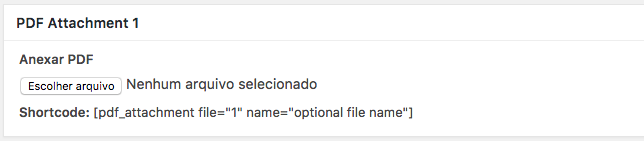
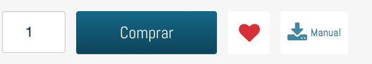

# Anexar manual em PDF no produto

Para incluir uma icon de PDF basta **Escolher** o Produto desejado e clicar em **editar**.

Na parte de baixo na página de editar produto tem um box para fazer upload de pdf.

1. Clique em **Escolher Arquivo**;
2. Irá abrir uma tela para você escolher o arquivo pdf para anexar ao produto;
3. Após selecionar basta clicar em **Atualizar/Salvar**;

Após salvar, podemos conferir clicando em ver produto, e irá mostrar um botão mostrando a opção de baixar o manual.

> Essa funcinalidade pode não está disponivel para sua loja, para isso basta solicitar ao seu gerente de contas.
