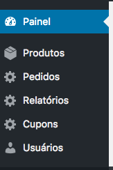
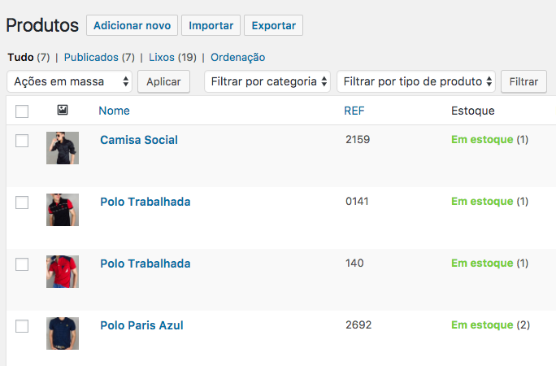
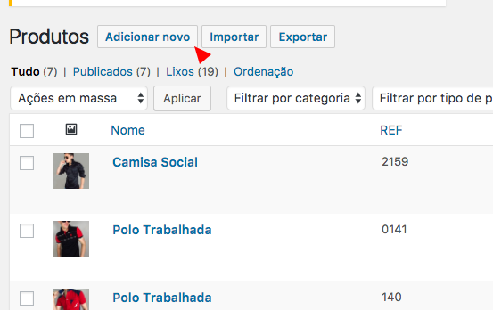
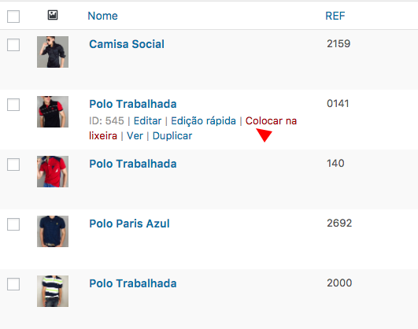

# Informações básicas

### Lista de Produtos

Para listar todos os produtos basta clicar em **Produtos** que será mostrar uma tabela dos produtos

*Lista de Produtos*

### Adicionar Um produto

Para Adicionar um produto apenas clicar em **Adicionar Novo**

### Editar um produto

Para Editar algum produto é só colocar o mouse em cima do produto e será mostrado uns links com opções de editar, e em seguida clicar em **Editar Produto**

