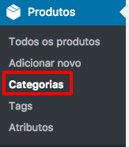
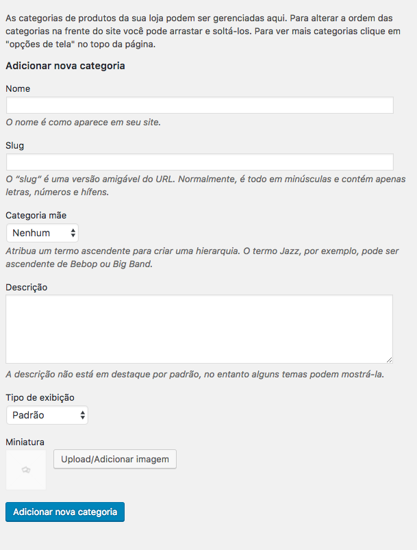
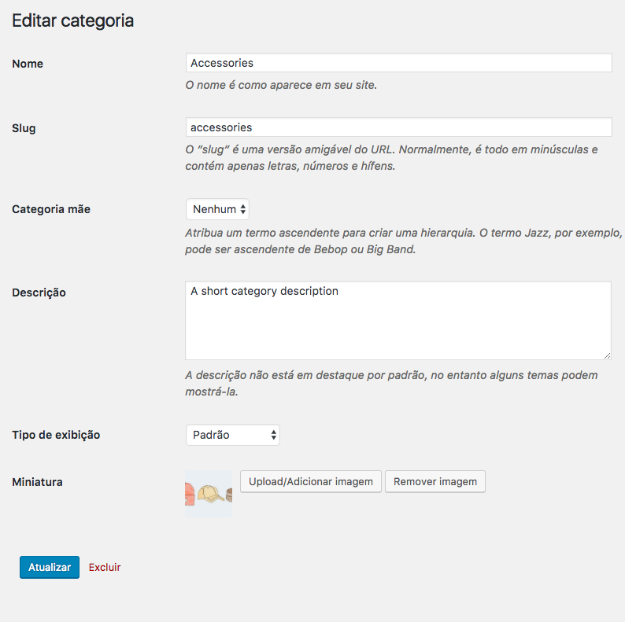
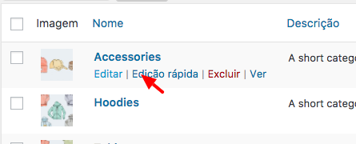

 # Categorias de Produtos

## Adicionar uma Categoria

Primeiramente para **adicionar** uma categoria você precisa clicar em **Produtos** > **Categorias**.

_tela de listagem de todas as categorias e adicionar categoria_

Após clicar em categoria, basta preencher os campos

1. **Nome**, (Não é necessário preencher o Slug).
2. **Categoria** Mãe (Informar qual categoria pai da a categoria atual)

Agora Só clicar em **Adicionar nova categoria**

## Editar uma Categoria

Primeiramente para **editar** uma categoria você precisa clicar em **Produtos** > **Categorias**.

_tela de listagem de todas as categorias_

Na tabela, basta visualizar a categoria que pretende editar, e posicionar o mouse em cima da linha da categoria e irá mostrar algumas opções, e entre elas a opção de **Editar**. Em seguida é clicar em **Editar**

Após clicar em **Editar**, irá mostrar tela com um formulário parecido com o de editar. E em seguida basta você editar o campo desejado.

**Nota**: Se for editado o nome, será necessário atualizar o **slug**, para isso é só apagar todo o texto do campo de **Slug**, e após clicar em **Atualizar** o sistema irá criar o **slug** automaticamente.

Após fazer a alterações da categoria desejada, agora é só clicar em Atualizar.

