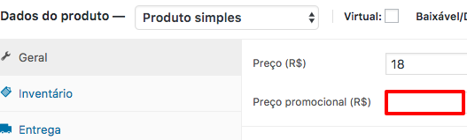
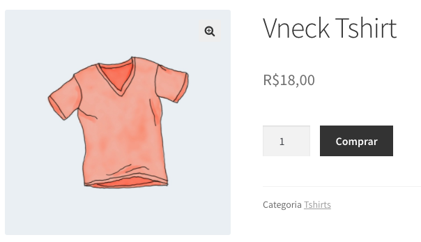
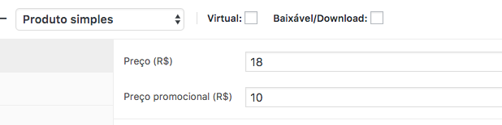
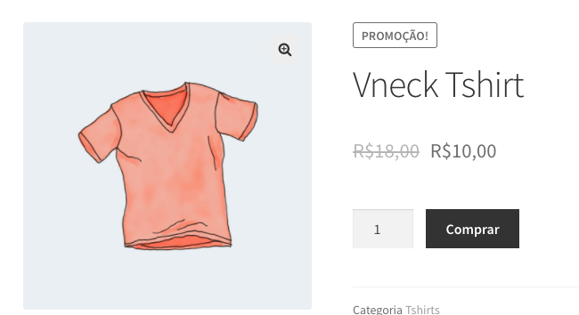
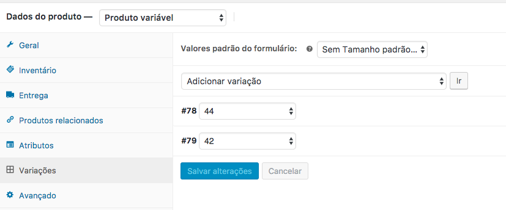
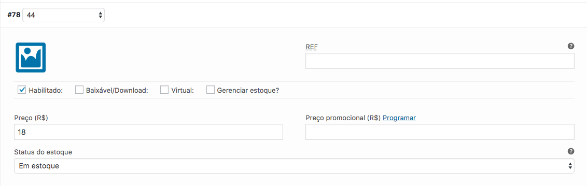
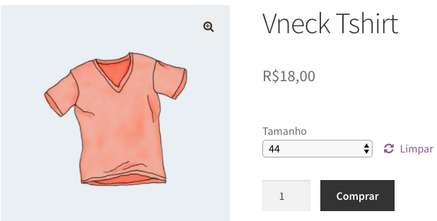
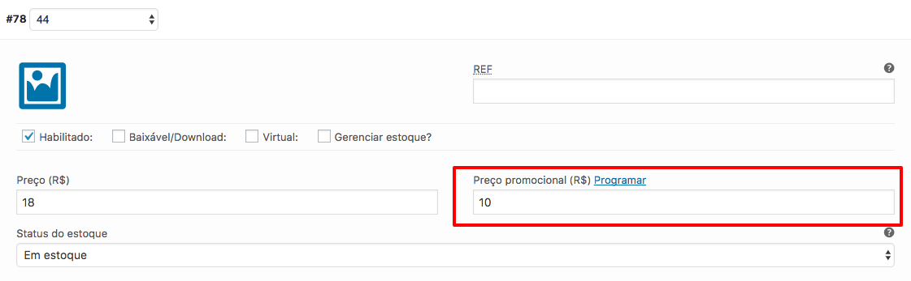
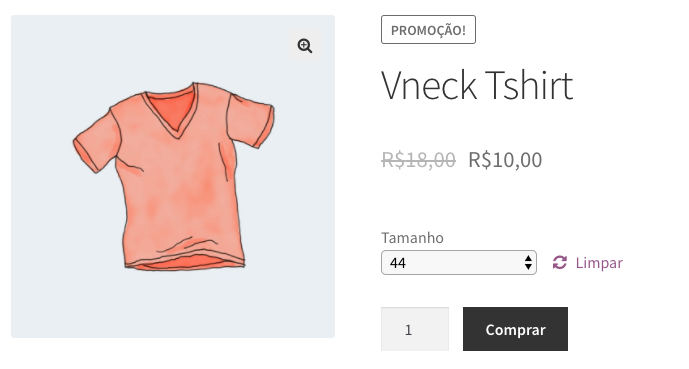

# Produto Promocional

Para ativar um valor promocional a um produto você primeiro deve selecionar um produto.

Em seguida editar o produto (a mesma metodologia vai server quando for adicionando novos produtos)

## Em produtos simples

### Antes (valor normal)

_Produto apenas com o valor Original do Produto_

_Landing page mostrando o produto apenas com o valor original do produto_

### Depois de ser Editado

_Produto com o valor promocional inserido_

_Landing page mostrando o produto com o valor promocional inserido_

## Em produtos Variante

### Antes de editar (valor normal)

1. Clique em **variações**

2. Selecione a **variação** desejada

__Landing page do produto sem o valor promocional_

### Depois de editado (valor normal)

Na variação selecionada basta inserir o valor promocional no campo de **Preço promocional**

_Landingpage do produto selecionado a variação com o preço promocional_

**Nota**: No produto variável, é possível uma variavel possuir promoção e a outra não.
