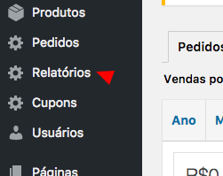
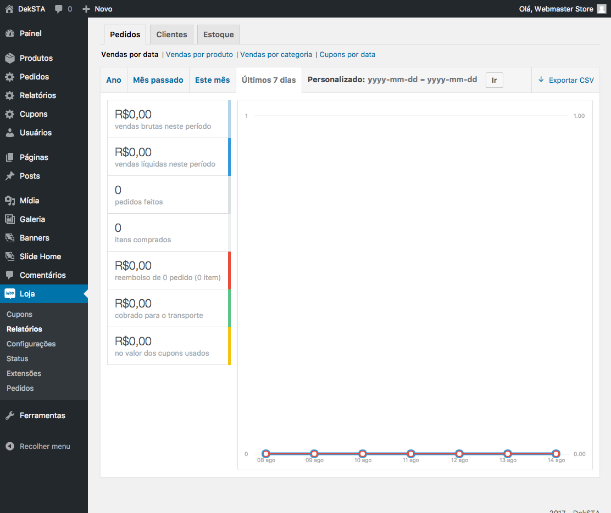

# Relatórios

Basta clicar no menu relatório e irá mostrar a página de relatórios

Nesta página é possivel relizar filtros por Ano, mes, e na última semana dos pedidos realizados, clientes cadastrados e do estoque dos produtos.

